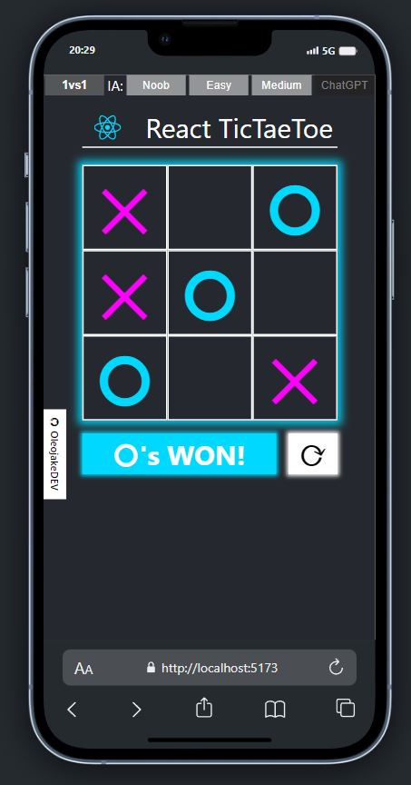

# React TicTacToe vs AI

The **tic-tac-toe** game developed with react components => ([live demo](https://react-tictaetoe.netlify.app/))

v1.0: First release

v1.1: Solved responsive on iOS

[](https://github.com/oleojake/react-tictaetoe-ia)

## How to Start
Clone or download the repository and use the command npm run dev to start the game by default on port http://localhost:5173/.

Use the top menu to select the game mode or the AI difficulty level.

## Game Modes
### Player vs Player
Play against a friend on the same mobile device, choose who will be X or O.
### Player vs AI
Different difficulty levels to play against the AI.

**NOOB:** The AI makes random moves across the board without following any pattern.

**EASY:** The AI prioritizes making a winning move.

**MEDIUM:** The AI prioritizes making a winning move, but if it detects that the opponent is one move away from winning, it will block them.

**CHATGPT:** A query is sent to the gpt-3.5-turbo model with the current board situation. If the move is invalid, for example, if it selects an already occupied square, the move will be decided using the AI with MEDIUM difficulty level.

## How to Use Your OPENAI API_KEY
By default, the mode with ChatGPT is disabled unless you provide a valid API_KEY. You can do this in the file **\src\core\IA\api\chatgpt-openia.api.ts** on line 1.

````JavaScript
export const API_KEY = null; // ENTER YOUR API_KEY TO PLAY VS OPENAI
````

## Some Screenshots




Any suggestions? I am open to receive feedback and improve the project => ([LinkedIn 📧](https://www.linkedin.com/in/pablo-marzal/))
